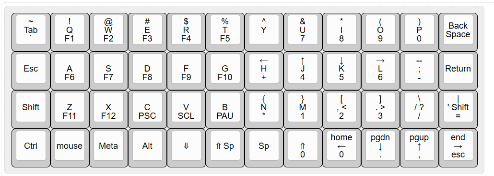

# My layout
https://www.keyboard-layout-editor.com/#/gists/80a5cdd1a2b1c112c019


# My Keyboards


# install dependencies
sudo apt install gcc-avr avr-libc gcc-arm-none-eabi avrdude dfu-util dfu-programmer

# setup QMK python tool
[QMK CLI](https://beta.docs.qmk.fm)
```
python3 -m pip install qmk
```
* disable modemmanager
```
sudo systemctl stop ModemManager.service
sudo systemctl disable ModemManager.service
qmk setup
```
* expect setup to install into ~/qmk_firmware
* use deploy.sh to perform build


# jj40 Board
```
qmk flash -kb jj40 -km rich
```

# setup bootloader
Flashing example for this keyboard ([after setting up the bootloadHID flashing environment](https://docs.qmk.fm/#/flashing_bootloadhid))
```
wget https://www.obdev.at/downloads/vusb/bootloadHID.2012-12-08.tar.gz
tar xf bootloadHID.2012-12-08.tar.gz 
cd bootloadHID.2012-12-08/commandline/
make
cp bootloadHID ~/.local/bin/
```

## additional udev rule for jj40
```
ATTRS{idVendor}=="16c0", ATTRS{idProduct}=="05df", MODE="0666", GROUP="plugdev"
```
* note: to flash unplug keyboard, hold backspace, then plugin keyboard

# teensy board
```
qmk flash -kb teensy -km rich
```

# setup bootloader
```
git clone git@github.com:PaulStoffregen/teensy_loader_cli.git
cd teensy_loader_cli/
make
cp teensy_loader_cli ~/.local/bin/
```